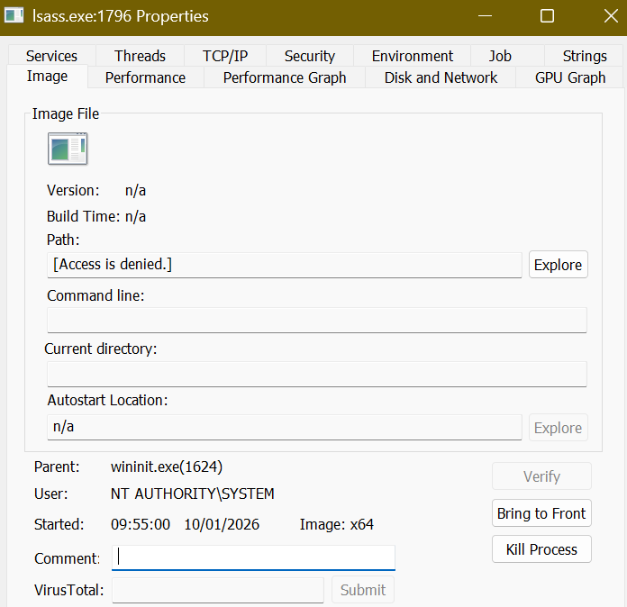

# Windows Internals Security Analysis (Blue Team Project)

## 📌 Project Overview
This project focuses on understanding critical Windows system processes
from a defensive cybersecurity (Blue Team) perspective.

The goal is to establish a baseline of normal behavior and identify
suspicious activity that could indicate attacks such as credential
dumping or process masquerading.

## 🎯 Objectives
- Understand core Windows processes and their security relevance
- Analyze parent–child process relationships
- Differentiate normal vs suspicious process behavior
- Build a Blue Team / SOC analyst mindset

## Tools & Environment

- Operating System: Windows 11
- Analysis Tool: Sysinternals Process Explorer
- Purpose: To analyze Windows internal processes from a security and defensive perspective
- - Windows Event Viewer
- PowerShell (basic commands)

## 📂 Project Structure
This repository will include:
- Normal behavior analysis of Windows processes
- Suspicious behavior simulations (safe & legal)
- Event log observations
- Detection-thinking notes
- Lessons learned

## 🚀 Why This Project Matters
Attackers often abuse trusted Windows processes to remain stealthy.
Security analysts must understand what “normal” looks like in order
to detect anomalies and respond effectively. Also, this is to help lot of beginners, aspiring to enter Cybersecurity.

## Windows Internals Analysis
### Day 1 – Project Setup & Basics

- Created GitHub repository for documenting learning
- Set up README structure
- Initial exploration of Windows processes
- Understood the concept of parent-child process relationships

### Day 2 – Core Windows Processes

- Studied core Windows processes such as:
  - System
  - smss.exe
  - csrss.exe
  - wininit.exe
- Observed parent-child relationships using Process Explorer
- Learned why some system processes show "Access Denied" paths
- Understood why certain processes do not have verified signatures
- Focused on identifying normal behavior vs suspicious patterns

### Day 3 – Security-Critical Windows Processes

- Focus on security-sensitive processes such as:
  - lsass.exe
  - winlogon.exe
  - services.exe
- Analyze why these processes are high-value targets for attackers
- Perform defensive observations using Process Explorer

#### lsass.exe – Local Security Authority Subsystem Service

- Image Path: Access Denied (protected system process)
- Verified Signer: Not displayed
- Parent Process: wininit.exe
- User Account: NT AUTHORITY\SYSTEM
- Instances: 1

**Security Relevance:**
lsass.exe is responsible for authentication and credential handling in Windows. 
It is a high-value target for attackers, which is why Windows restricts access 
to this process and hides certain details.

**Observations:**
The process behavior observed matches expected normal behavior. No suspicious 
patterns such as multiple instances, unusual parent processes, or user-level 
execution were detected.

**Process Explorer Observation:**

